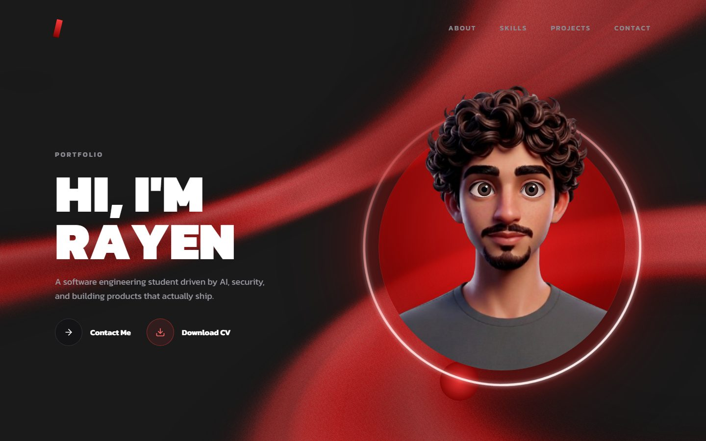
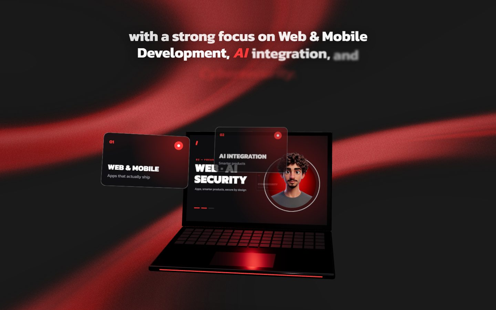
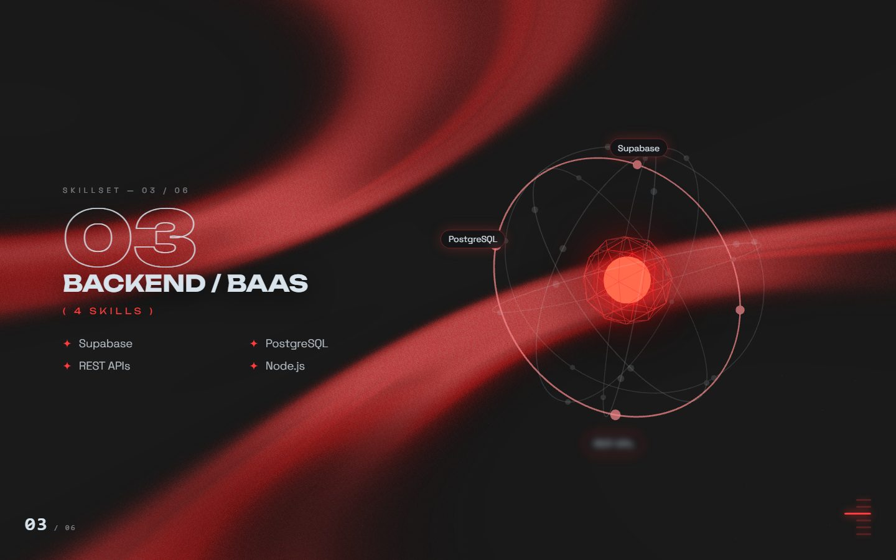
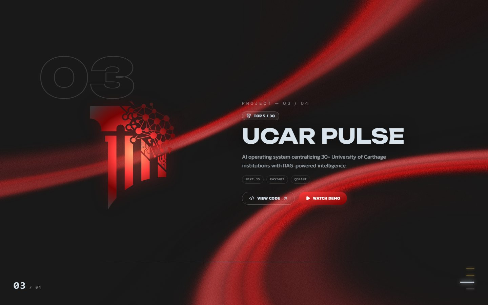
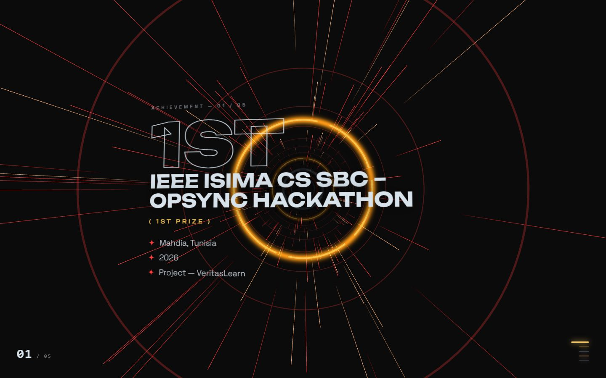
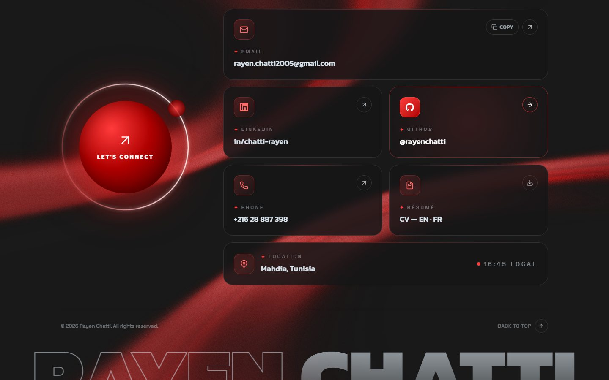

<div align="center">

# Rayen Chatti — 3D Portfolio

**Interactive, scroll-driven 3D portfolio of a Software Engineering student focused on Web & Mobile, AI and Cybersecurity.**

Next.js 16 · React 19 · TypeScript · Three.js / React Three Fiber · Framer Motion · Tailwind CSS v4

<!-- Live site: add the Vercel URL here after deploying -->



</div>

---

## About

This is my personal portfolio. Instead of a static page, every section is its own small scene: the page pins while you scroll, and the scroll drives a 3D camera, text reveals and transitions. It covers who I am, my skills, the projects I've shipped, my hackathon results, and how to reach me, with my CV in English and French.

## Sections

| Section | What happens |
|---|---|
| **Hero** | My portrait is alive: the head turns toward the cursor with fake 3D parallax, the eyes lead the head, and it blinks and glances around when idle. Rendered in WebGL with a hand-built depth map. |
| **About** | A floating 3D laptop opens as you scroll. Its screen changes with each line of the bio, focus cards fly out of it, embers rise at the end, and the lid closes as the section leaves. |
| **Skills** | Six skill categories, each with its own orbit of technologies around a glowing core, switched as you scroll. |
| **Projects** | "Forge" scene: each project's logo ignites with a hot sweep, the details land one by one, then the logo burns out into embers before the next one forms. Links to code, plus in-page YouTube demos. |
| **Achievements** | A black-hole portal swallows the title letter by letter, then the camera dives through a tunnel of gates, one per hackathon result. |
| **Contact** | Contact cards (email with copy, LinkedIn, GitHub, phone, CV, live local time), a contact form, and a pop-out to view or download the CV in English or French. |

<table>
  <tr>
    <td></td>
    <td></td>
  </tr>
  <tr>
    <td></td>
    <td></td>
  </tr>
  <tr>
    <td colspan="2"></td>
  </tr>
</table>

## Featured work

| Project | Result | Stack |
|---|---|---|
| [VeritasLearn](https://github.com/rayenchatti/veritaslearn) — AI study assistant (lessons, quizzes, flashcards) | 🥇 1st Prize, IEEE ISIMa CS SBC OPSYNC Hackathon | React Native, Supabase, Groq |
| [LifePass](https://github.com/rayenchatti/LifePass) — medical records shared through a personal QR code | 🥇 1st Prize, DevHeist (ISIMa DevOps Club) | React, Tailwind, Framer Motion |
| [UCAR Pulse](https://github.com/rayenchatti/UCAR-Pulse) — AI platform for 30+ University of Carthage institutions | Top 5 / 30 teams, HACK4UCAR 2025 | Next.js, FastAPI, Qdrant |
| [ITGate AI Assistant](https://github.com/rayenchatti/ITGate-internship) — company-grounded RAG assistant on a local LLM | Summer internship, ITGate Group | Spring Boot, FastAPI, Ollama |

## Tech stack

- **Framework:** Next.js 16 (App Router, Turbopack), React 19, TypeScript
- **3D / WebGL:** three.js with React Three Fiber and drei (About, Skills and Achievements scenes, animated page background), OGL (hero portrait shader)
- **Animation:** Framer Motion: scroll-linked timelines, springs, shared transitions
- **Styling:** Tailwind CSS v4, Kanit, Unbounded and Space Grotesk via `next/font`
- **Icons:** lucide-react
- **Contact form:** Web3Forms (optional), with a `mailto:` fallback

## Under the hood

- **Scroll-driven scenes.** Each 3D section is a tall container with a sticky stage. Its scroll progress (0 → 1) drives both the WebGL camera and the DOM text from one shared timeline file (`portalTimeline.ts`, `skillsTimeline.ts`), so 3D and text stay in lockstep.
- **Portrait parallax.** The hero portrait is a flat PNG. A fragment shader shifts each pixel by a hand-made depth map (skull dome, face and nose closer, shoulders further back), so small shifts read as the head turning. The eyes are redrawn in the same shader so they stay locked to the face.
- **Canvas textures.** The laptop screen, focus cards and lid badge are drawn with the 2D canvas API and used as live textures, repainted only when their content changes.
- **Performance.** WebGL loops pause when their section is off-screen or the tab is hidden, heavy scenes load client-side only (`next/dynamic`, `ssr: false`), and the page is fully prerendered as static content.
- **Accessibility.** Every scene has a `prefers-reduced-motion` fallback (static layouts, no camera moves). Dialogs close with Escape, lock background scroll and return focus. Decorative layers are hidden from screen readers.

## Project structure

```
src/
  app/
    layout.tsx            # fonts, metadata, persistent animated background
    page.tsx              # section order
    globals.css
  components/
    HeroSection.tsx       PortraitHead.tsx (WebGL portrait)
    AboutSection.tsx      DeskScene.tsx (floating laptop)  deskScreens.ts (canvas textures)
    ServicesSection.tsx   SkillsScene.tsx  skillsTimeline.ts
    ProjectsSection.tsx
    AchievementsSection.tsx  PortalScene.tsx  portalTimeline.ts  blackHole.ts
    ContactSection.tsx    ContactForm.tsx  CvDialog.tsx  cv.ts
    ColorBends.tsx        # page background shader
public/
  cv/                     # CV PDFs (EN / FR) and their previews
  projects/masks/         # project logos as white masks, lit by the site's red
docs/screenshots/         # images used in this README
```

## Getting started

Requires Node.js 20.9 or newer.

```bash
git clone https://github.com/rayenchatti/Portfolio.git
cd Portfolio
npm install
npm run dev        # http://localhost:3000
```

| Command | What it does |
|---|---|
| `npm run dev` | Development server with hot reload |
| `npm run build` | Production build (type-checks, prerenders) |
| `npm run start` | Serve the production build |
| `npm run lint` | ESLint |

### Environment variables

| Variable | Required | Purpose |
|---|---|---|
| `NEXT_PUBLIC_WEB3FORMS_KEY` | No | A free [Web3Forms](https://web3forms.com) access key. With it, the contact form delivers messages straight to my inbox. Without it, the form opens the visitor's email app with the message pre-filled. |

Put it in `.env.local` for local development, and in the Vercel project settings for production.

### Updating the CV

Replace `public/cv/Rayen-Chatti-CV-EN.pdf` or `Rayen-Chatti-CV-FR.pdf` (keep the file names), update the preview images next to them, and change `CV_UPDATED` in `src/components/cv.ts`.

## Deployment

Deployed on **Vercel**: import the repository, keep the detected Next.js settings, optionally add `NEXT_PUBLIC_WEB3FORMS_KEY`, and deploy. Every push to `main` redeploys.

## Contact

- **Email:** [rayen.chatti2005@gmail.com](mailto:rayen.chatti2005@gmail.com)
- **LinkedIn:** [in/chatti-rayen](https://linkedin.com/in/chatti-rayen)
- **GitHub:** [@rayenchatti](https://github.com/rayenchatti)

---

<div align="center">

© 2026 Rayen Chatti. All rights reserved. The design, portrait and content are mine; feel free to read the code for learning.

</div>
